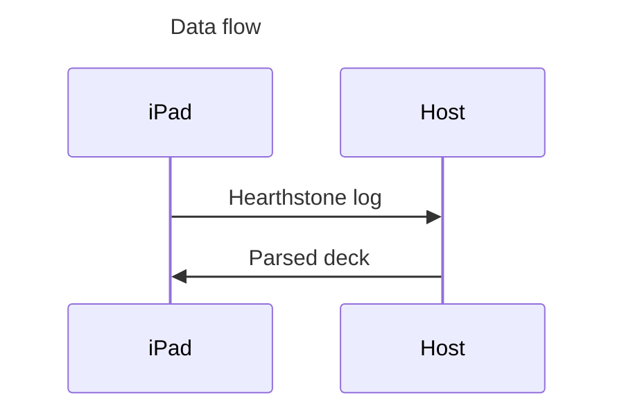

# PaddingStove

The world first deck tracker for Hearthstone for iPad.

## Limitations

- A running computer in the same Wi-Fi as iPad is required.
- Tracker overlay is a web page and you have to operate and resize it on your own.

## Getting started

>  [!WARNING]
>
>  **This is the very early version of the tracker. The steps are compliacted and to be improved.**

### For all system

Install latest [.Net SDK](https://dotnet.microsoft.com/en-us/download)

### macOS

You can install required dependencies with homebrew.

``` shell 
brew install libimobiledevice
```

### Windows

WIP. You may have to compile `libimobiledevice` by yourself.

### Arch Linux (Unverified)

``` shell
sudo pacman -Syu libimobiledevice
```

The libiray for macOS and Windows will be bundled in future and you won't need to install them by yourself.

## Device parperation

1. Connect your iPad to your machine with wire.
2. Transfer [log.config](./utils/log.config) to you iPad, the root folder of your Hearthstone app with Finder/[Apple Devices](https://apps.microsoft.com/detail/9np83lwlpz9k)/[iTunes](https://www.apple.com/itunes/).
3. Enable `Show this iPad when on Wi-Fi` (Finder) or `Sync with this iPad over Wi-Fi` (iTunes).
4. Unplug wire.

## Run

The running process is pretty simple and straightforward, just run

``` shell
dotnet run --project HCGStudio.PaddingStove.Hosting -- --urls http://0.0.0.0:8080
```

And view `http://[your-local-ip-or-hostname]:8080` on your iPad.

------

To debug with UI change, go to directory `front-end` and run

``` shell
yarn install
yarn start
```

And the backend project should be started with the default port.

``` shell
dotnet run --project HCGStudio.PaddingStove.Hosting
```

> [!NOTE]
>
> You should have Node.js installed if you have any changes to UX.

## How does this works

Due to Apple limitations, App can't read logs from any other Apps without a jailbreak. Deck trackers rely on log reading to work. However, reading iPad logs with computer is simple. We can read Hearthstone longs with computer, process and transfer result back to your iPad.

