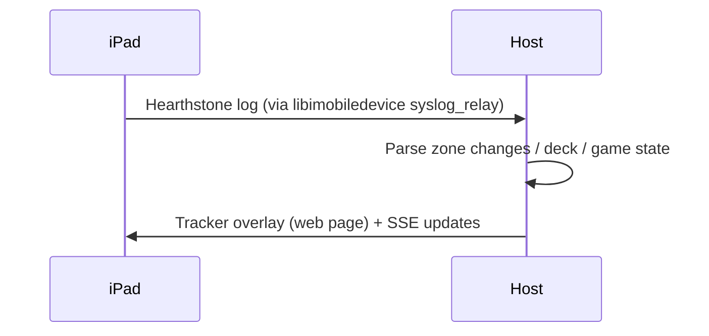

# PaddingStove

The world's first deck tracker for Hearthstone on iPad.

[](https://github.com/HCGStudio/PaddingStove/actions/workflows/ci.yml)

## How it works

iOS sandboxing prevents an iPad app from reading another app's logs, so PaddingStove offloads log reading to a desktop host on the same Wi-Fi:


```mermaid
sequenceDiagram
    iPad->>Host: Hearthstone log (via libimobiledevice syslog_relay)
    Host->>Host: Parse zone changes / deck / game state
    Host->>iPad: Tracker overlay (web page) + SSE updates
```

The host (.NET 9 + ASP.NET Core) reads the iPad's syslog over the network, parses Hearthstone's `Power.log` and `Zone.log` lines, and serves a React tracker UI back to the iPad's browser. Updates stream in via Server-Sent Events.

## Limitations

- A computer on the same Wi-Fi as the iPad must be running the host.
- The tracker is a web page in iPad Safari — you operate, position and resize it yourself.

## Getting started

> [!WARNING]
> This is an early version. The setup is somewhat manual; see the open issues for planned automation.

### Prerequisites (all platforms)

Install the latest [.NET 9 SDK](https://dotnet.microsoft.com/en-us/download).

If you plan to modify the front-end, install [Node.js](https://nodejs.org/) (20+) and enable Yarn via Corepack:

```shell
corepack enable
```

### Install libimobiledevice

#### macOS

```shell
brew install libimobiledevice
```

#### Arch Linux (unverified)

```shell
sudo pacman -Syu libimobiledevice
```

#### Windows

WIP. You currently need to compile `libimobiledevice` yourself or use a third-party Windows port. Native bundling is tracked as an open task.

> Native libraries for macOS and Windows will be bundled in a future release so you don't have to install them by hand.

### Prepare the iPad

1. Connect your iPad to the host with a cable.
2. Copy [`utils/log.config`](./utils/log.config) into the Hearthstone app's root folder using Finder, [Apple Devices](https://apps.microsoft.com/detail/9np83lwlpz9k), or iTunes.
3. Enable **Show this iPad when on Wi-Fi** (Finder) or **Sync with this iPad over Wi-Fi** (iTunes).
4. Unplug the cable. The iPad should still appear to the host while on the same Wi-Fi.

## Run

```shell
dotnet run --project HCGStudio.PaddingStove.Hosting -- --urls http://0.0.0.0:8080
```

Then open `http://<host-ip-or-hostname>:8080` on the iPad. The host's MSBuild target will build the front-end (via `yarn`) and copy it into `wwwroot/` automatically. Pass `-p:SkipFrontEndBuild=true` to skip that step if you don't have Node installed.

## Develop

Backend in dev mode (enables OpenAPI at `/openapi` and CORS for local front-end dev):

```shell
dotnet run --project HCGStudio.PaddingStove.Hosting
```

Front-end (Parcel dev server, talks to the backend on its default port):

```shell
cd front-end
yarn install
yarn start    # dev server
yarn build    # production build into dist/
```

Run the test suite:

```shell
dotnet test
```

## Architecture

- **`HCGStudio.PaddingStove.Core`** — domain logic. Parses Hearthstone log lines into `IBoardChange` events, mutates per-device deck state, exposes `GameBoardStatus` snapshots. No ASP.NET dependency.
- **`HCGStudio.PaddingStove.Hosting`** — ASP.NET Core API + static-file host. Serves the built front-end out of `wwwroot/` with SPA fallback to `index.html`. Streams board updates over SSE at `/api/Tracker/{deviceId}`.
- **`front-end`** — React 18 + Mantine + SWR, bundled with Parcel. Connects to the SSE endpoint and renders the deck tracker.
- **`HCGStudio.PaddingStove.Core.Tests`** — xUnit tests for the log parser regexes.

The `submodules/HearthDb` git submodule is required (`git submodule update --init --recursive`).
